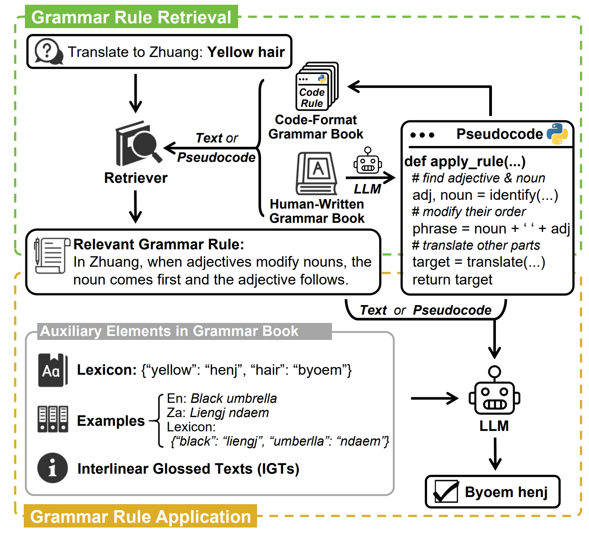

# ZhuangRules
[ACL'25] Read it in Two Steps: Translating Extremely Low-Resource Languages with Code-Augmented Grammar Books

<div align=center>
	
</div>

## Dataset

**Important: Preventing Test Set Contamination**
We encrypted the source files of ZhuangRules in `data.zip` to prevent test set contamination. 
The password is `zhuangrules`.
Please unzip the file and place the content into `./data` directory.

List of files:
* `zhuangrules_v0.json`: The full ZhuangRules dataset.
* `zhuangrules_v0_for_test.json`: Test version of the dataset, generated via `convert_to_test_format.py`.
* `zhuang_dictionaries.json`: All Zhuang grammar rules used in the dataset.
* `annotated_multi_rules_all.json`: All annotated multi-rule test instances.
* `code_grammars/`: Code-based grammars proposed in our paper.
* `igt/`: Annotated Interlinear Glossed Texts (IGT).
* `kalamang/`: Extracted grammar rules from *A Grammar of Kalamang*.
* `wals/`: Annotated linguistic domains for each rule, based on the WALS taxonomy.

## Code

Use the scripts in `./scripts` to run the LLMs and evaluate the results.

## License
The license for the code and data is MIT. 

## Citation
```
@misc{zhang2025readstepstranslatingextremely,
      title={Read it in Two Steps: Translating Extremely Low-Resource Languages with Code-Augmented Grammar Books}, 
      author={Chen Zhang and Jiuheng Lin and Xiao Liu and Zekai Zhang and Yansong Feng},
      year={2025},
      eprint={2506.01796},
      archivePrefix={arXiv},
      primaryClass={cs.CL},
      url={https://arxiv.org/abs/2506.01796}, 
}
```